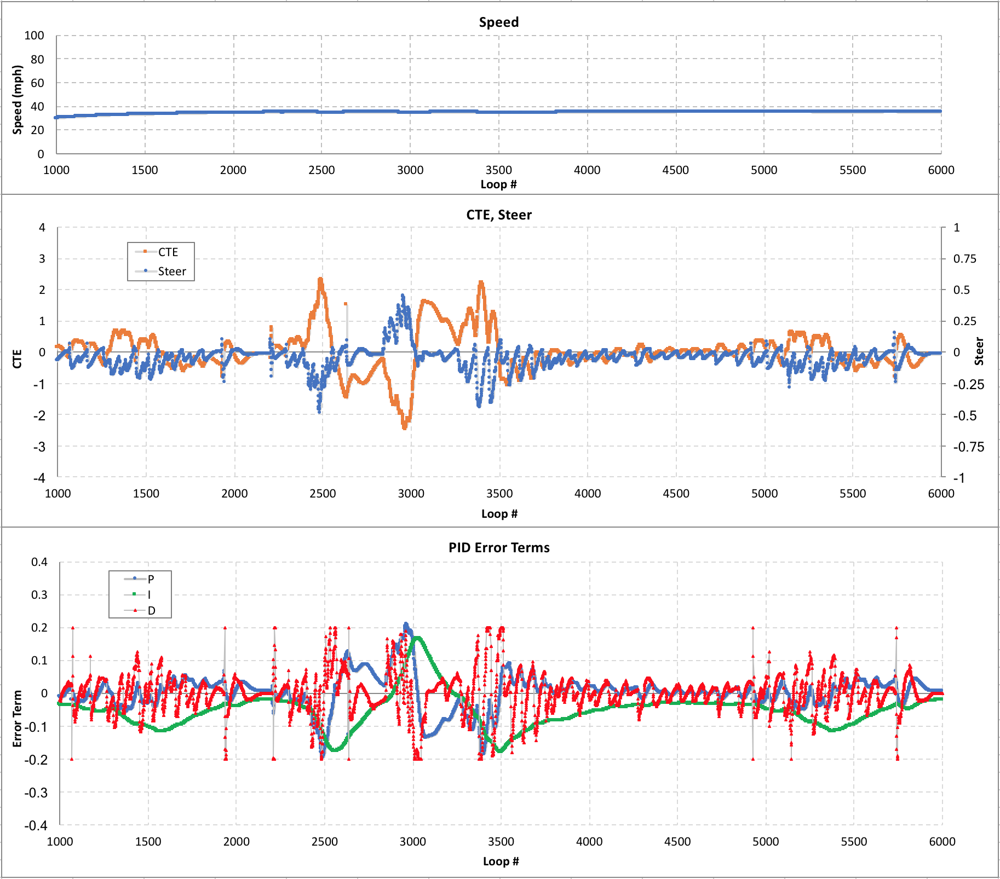

# **PID Control Project - Reflection**

**Udacity Self Driving Car Nanodegree - Project #9**

2017/10/16

## Initial Manual Tuning to Explore P, I, D Component Effects

PID (Proportional, Integral, Derivative) controllers are one of the **simplest types of feedback controller** to implement, but can sometimes be very **difficult to tune for good stable performance in all conditions**, especially for controlling something like the position of a vehicle by its steering wheel.

Controlling a vehicle's steering angle directly with feedback from lateral Cross-Track Error (CTE) measurements without any feed-forward or look-ahead component is **like trying to drive while looking straight down at the ground** beneath the vehicle.  Also, the controller affects the **yaw angle of the vehicle to indirectly adjust the lateral position** without any way to plan proper counter-steering to keep the vehicle's yaw aligned with the road once the CTE is minimized.

This means that tuning these PID gains will always have some **oscillation or overshoot** which will become more severe as the vehicle's speed increases, so **this kind of PID control application is not really well-suited for controlling the steering of a vehicle**, but can be useful as an exercise to explore the P, I, and D component effects in general.

### P Control

Due to the inherent instabilities of steering angle feedback from CTE mentioned above, using only Proportional control is **not feasible** because the vehicle will **constantly overshoot and oscillate no matter what value of P gain is used**.  In order to stabilize the control, the Derivative component must also be used to do some counter-steering as the error is decreasing but before crossing over zero to reduce the lateral overshoot.

### PD Control

To tune a PD controller, I initially chose a **P gain that was strong enough to keep the CTE within the track width through the sharpest turns** of the track while the **D gain was also set high enough to prevent oscillations** from causing the vehicle to crash.  Example simulator data is shown in Fig.1 below where the vehicle could maintain 35 mph (constant 0.3 throttle setting) and CTE stayed within 3 m to stay on the track.

*Figure 1 - PD control (P = 0.1, D = 2.0)*

From Fig.1 above, there are some **noise spikes in the steering angle** that come from spikes in the D error term.  These spikes are from **discontinuities in the raw CTE measurements** which are **amplified by the D gain** that is applied to the discrete derivative of the CTE signal.  In the real world, these spikes would cause unacceptable steering behavior so **some filtering is needed**.

### PD Control with Filters

To improve the control smoothness and robustness to noise, some filters were implemented including:

1. D term max guard
2. D term smoothing by an [exponential smoothing factor](https://en.wikipedia.org/wiki/Exponential_smoothing)
3. PID output rate limit

The **D term max guard** was tuned based on the magnitude of the D error term's general movement in the data.

The **D term smoothing** was tuned to be as small as possible to prevent response delay that could cause instability from the control phase shift but still provide some smoothing benefit.

The **PID output rate limit** was tuned based on what seemed to be needed to allow reasonably quick enough steering movement in the sharp turns, similar to how a real driver would not turn the steering wheel faster than a certain rate.

The results are shown in Fig.2 below.

*Figure 2 - PD control with filters (D term max guard = 0.2, D term smoothing factor = 3, PID output rate limit = 0.05)*

The filters improved the noise spikes in steering and D error term while still maintaining the overall control behavior.  However, the CTE still has some **steady offset from zero** such as between loop #4000-5000 which is a long gradual turn in the track.  To reduce this offset, the Integral component is also needed.

### PID Control

To tune the PID controller, I kept the P and D gains from the PD controller and simply started **adding I gain until the CTE offset was eliminated overall** without causing additional oscillations and overshoots.  The results are shown in Fig. 3 below.

*Figure 3 - PID control (P = 0.1, I = 0.001, D = 2.0)*

The I error term movement is steady overall and has peak magnitudes similar to the P and D terms in the sharp turns at loop #2500-3000.  This had the additional benefit of reducing the peak CTE from ~3 m to ~2 m.

The steering movement is still not really smooth as expected from the limitations of this kind of application, but at least **the vehicle was able to drive around the track** with pretty simple straight-forward tuning of the gains.  In order to see if further improvement was possible by finer tuning, the **"twiddle" (coordinate ascent) algorithm** was also implemented.

## Twiddle Automatic Tuning to Choose Final Hyperparameters

The twiddle algorithm automatically runs repeated simulations to test if adjusting the gain parameters up or down a little can improve an overall error function.  Each time the error function result is improved, the gain adjustment is kept and then twiddled further with larger or smaller deltas until no further benefit is found.

To implement this, the **initial gains** were set as the base PID controller gains discussed previously, and the **initial deltas** were set to be half of the magnitudes of each gain.  The **error function** was set as the **accumulation of CTE plus the accumulation of steering angle**.  This combination tries to minimize the overall CTE while also penalizing busy steering work.

After twiddling, the P gain reduced from 0.1 to 0.084271, the I gain reduced from 0.001 to 0.000690, and the D gain increased from 2.0 to 3.00000.  The final result of this controller's driving is shown in Fig.4 below.

*Figure 4 - PID control after twiddling (P = 0.084271, I = 0.000690, D = 3.00000)*

Overall, the **steering is slightly more aggressive** from the increased D gain, but the **CTE is kept a little tighter around zero**.  This means that the error function still biased toward reducing CTE more than keeping smooth steering.

To see if this final controller setting was able to drive around the track at higher speeds, some runs were done with increased throttle.  At throttle = 0.5 shown in Fig.5 below, the vehicle was still **able to drive around the track at ~60mph** but the steering started getting pretty aggressive.

*Figure 5 - Twiddled PID at throttle = 0.5*

However, pushing the throttle to 0.9 or 1.0 caused the vehicle to become unstable and quickly go off track.  Just for fun, I did some additional trials to see what kind of controller would be needed to be able to stay on the track at high speed.

### Max speed trial

At max speed, the **control response is the highest priority** so the filters had to be mostly disabled.  The I term movement was also too slow to provide any benefit so only P and D gains were used.  With P gain at 0.08 and D gain increased to 5.0, the vehicle was **able to complete a few laps of the track at ~95mph** with constant 0.9 throttle.  However, it was right on the edge of stability and crashed after loop #5700, shown in Fig.6 below.

*Figure 6 - PD control at throttle = 0.9 (filters mostly disabled for max response)*

Some further improvement could be possible by using some control logic on the throttle itself, but pushing the car to 95mph with a basic PD controller was enough fun for now.